## 1.参考

[官方地址](https://www.jenkins.io/)

[中文社区地址](https://www.jenkins-zh.cn/)


## 2.前置条件

**系统版本:** any

**软件依赖:** any

**权限要求:** root

**网络要求:** any

**其他注意事项:** 

## 3.环境准备

### 3.1.linux

[docker安装](../部署教程/Linux Docker服务安装.md)

## 4.安装部署

### 4.1.linux

[docker安装jenkins服务](../部署教程/docker/Docker Jenkins服务安装.md)

## 5.配置说明

### 5.1.Plugin 插件

| 插件编码                    | 插件名称         |
| --------------------------- | ---------------- |
| Config File Provider Plugin | 配置文件程序插件 |
| Maven Integration plugin    | Maven 集成插件   |
| Publish Over SSH            | SSH发布插件      |

### 5.2.Config File Provider Plugin

**maven-setting**

```xml
<?xml version="1.0" encoding="UTF-8"?>
<settings xmlns="http://maven.apache.org/SETTINGS/1.0.0" 
          xmlns:xsi="http://www.w3.org/2001/XMLSchema-instance" 
          xsi:schemaLocation="http://maven.apache.org/SETTINGS/1.0.0 http://maven.apache.org/xsd/settings-1.0.0.xsd">
   <servers>
       <server>
           <id>maven-public</id>
           <username>dev-manager</username>
           <password>123456</password>
       </server>
       <server>
           <id>maven-releases</id>
           <username>dev-manager</username>
           <password>123456</password>
       </server>
       <server>
           <id>maven-snapshots</id>
           <username>dev-manager</username>
           <password>123456</password>
       </server>
   </servers>
   <mirrors>
       <mirror>
           <id>maven-public</id>
           <mirrorOf>*</mirrorOf>
           <url>http://192.168.1.12:8081/repository/maven-public/</url>
       </mirror>

        <mirror>
            <id>maven-default-http-blocker</id>
            <mirrorOf>external:http:*</mirrorOf>
            <name>Pseudo repository to mirror external repositories initially using HTTP.</name>
            <url>http://0.0.0.0/</url>
            <blocked>true</blocked>
        </mirror>
   </mirrors>
   <profiles>
       <profile>
           <id>local-snapshot</id>
           <repositories>
               <repository>
                   <id>local-snapshot</id>
                   <url>http://192.168.1.12:8081/repository/maven-public/</url>
                   <releases>
                       <enabled>true</enabled>
                       <updatePolicy>always</updatePolicy>
                   </releases>
                   <snapshots>
                       <enabled>true</enabled>
                       <updatePolicy>always</updatePolicy>
                   </snapshots>
               </repository>
           </repositories>
       </profile>
   </profiles>
   <activeProfiles>
       <activeProfile>local-snapshot</activeProfile>
   </activeProfiles>
</settings>
```


## 6.常用操作

### 6.1.安装配置 Config File Provider Plugin

**安装插件**

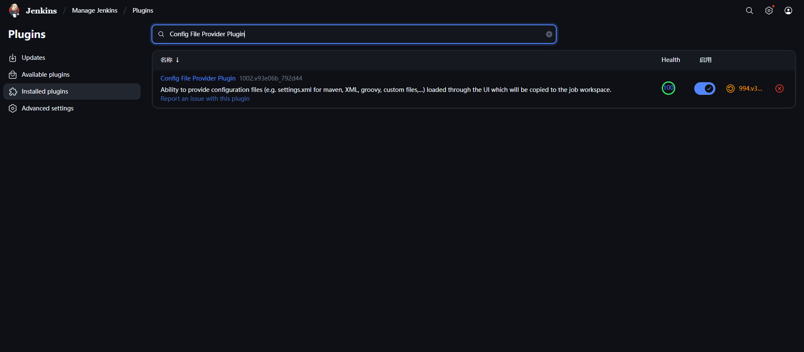

**新增配置**

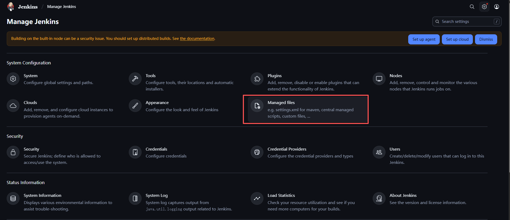

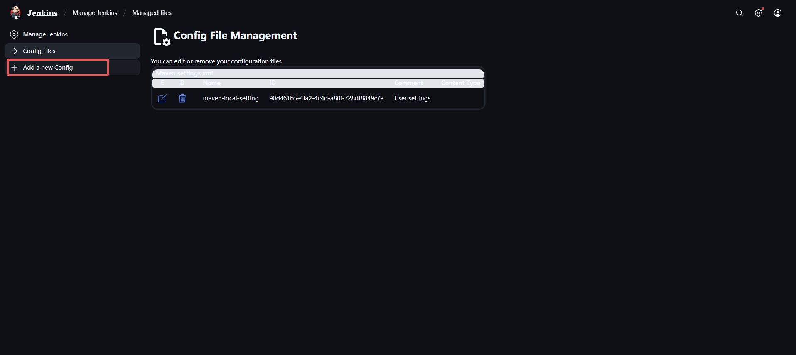

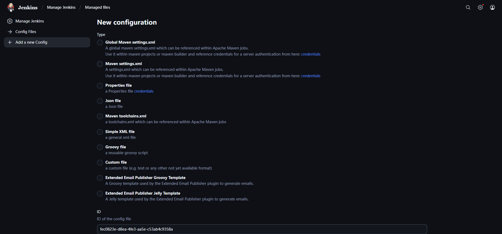

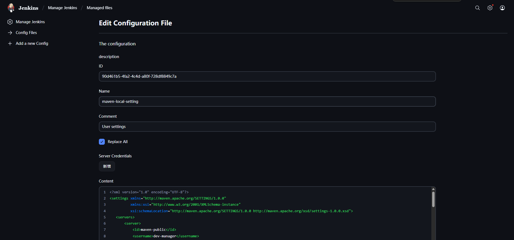

**全局使用maven配置**

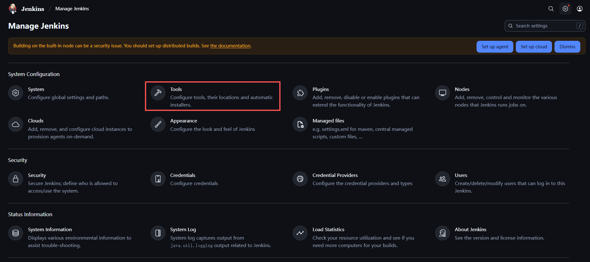

**局部使用maven配置**

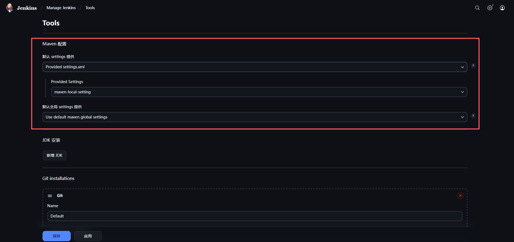

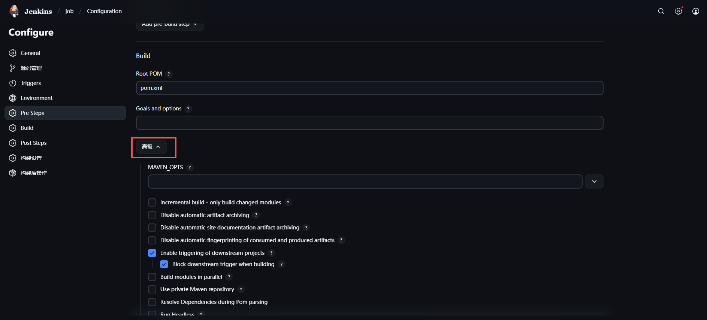

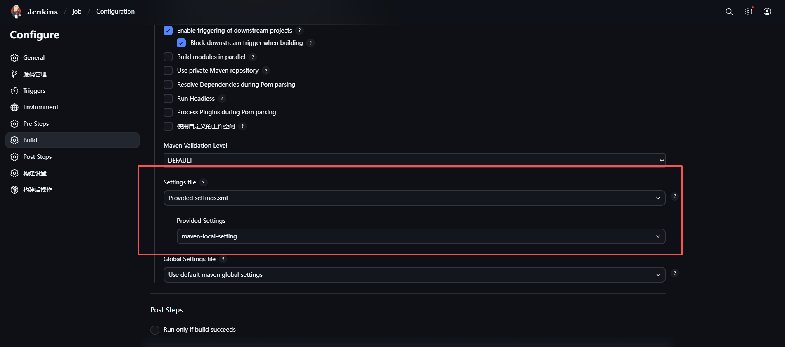

### 6.2.安装配置 Maven

**全局配置**

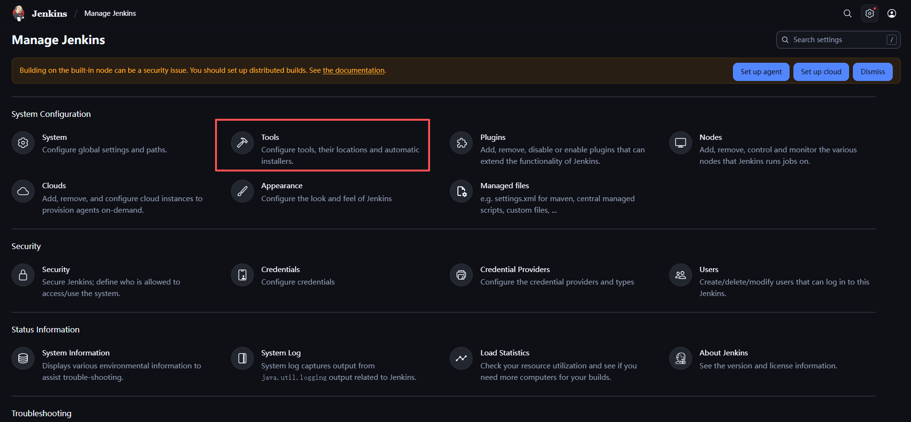

**Maven安装**

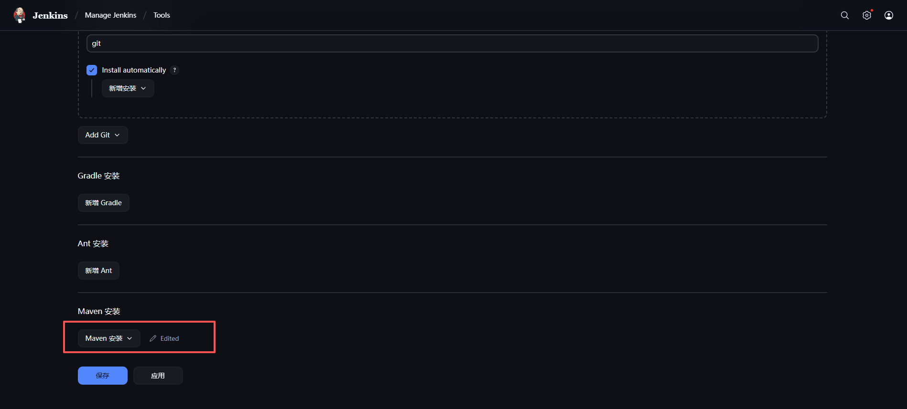

**自动安装**

install automatically 在使用这maven时会自动下载

安装位置：`./tools/hudson.tasks.Maven_MavenInstallation`

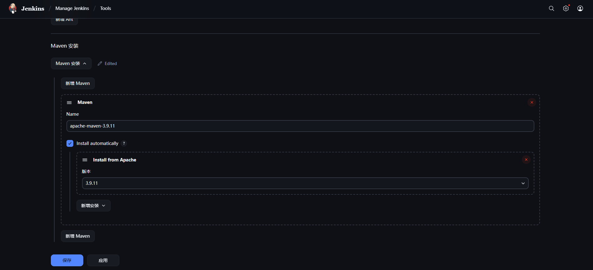

### 6.3.安装配置 Publish Over SSH

**安装插件**

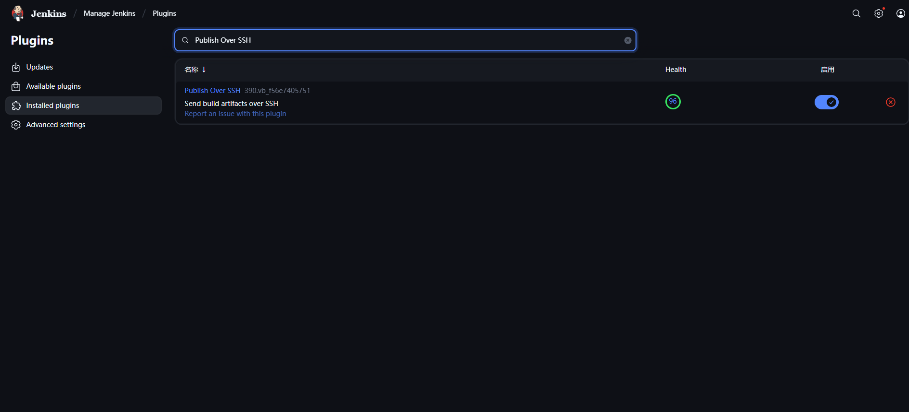

**配置SSH Servers**

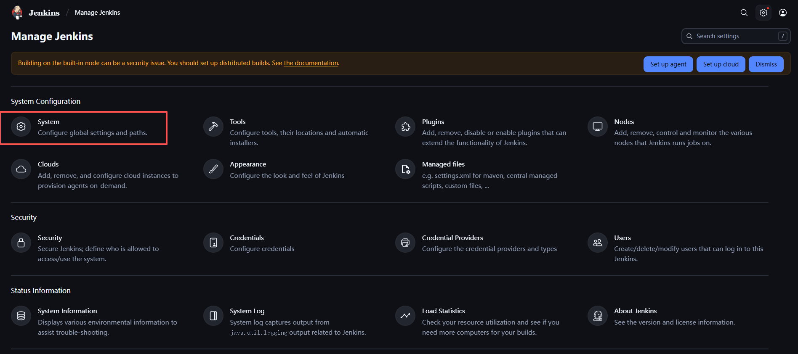

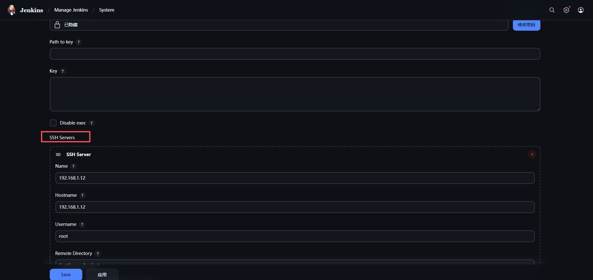

**配置密码和发布目录**

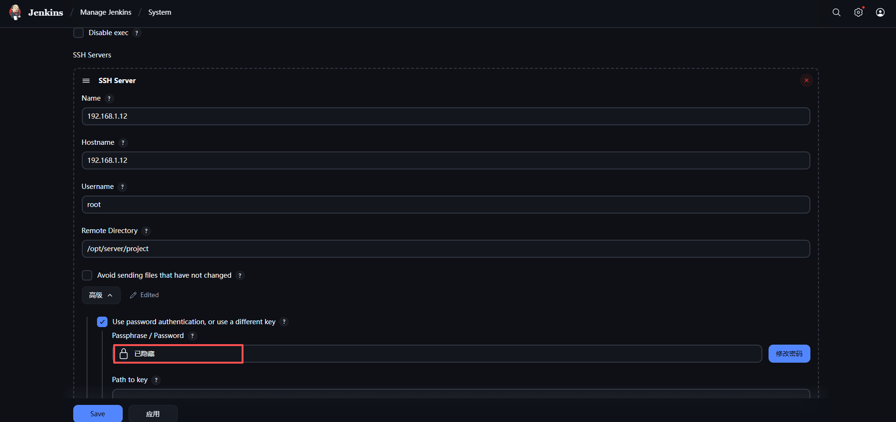

**job配置发布**

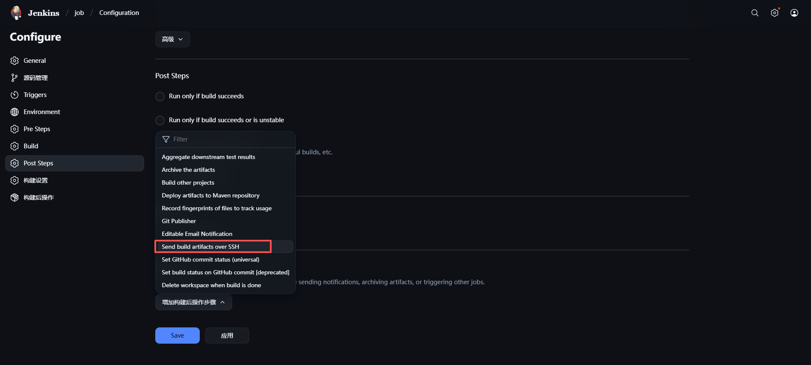

`SourceFiles`工作区代发布文件

`Remove prefix`删除前缀

`Remote Directory`发布位置（默认时选定SSH的发布目录）

`Exec command`自定义执行命令

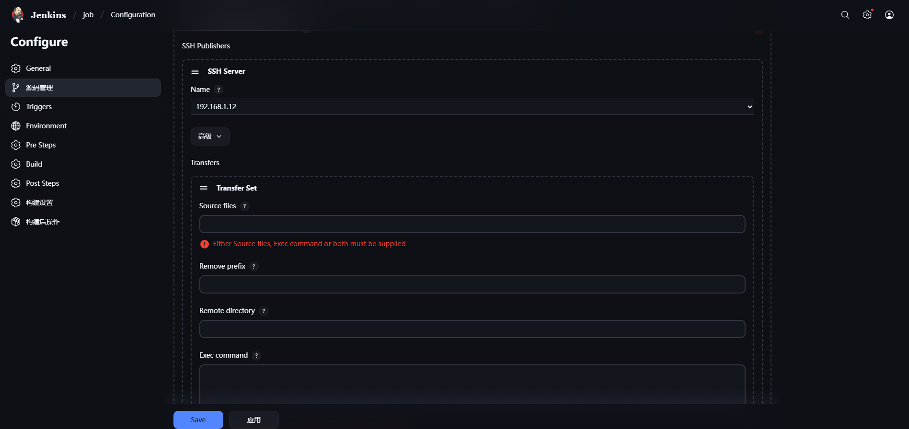

## 7.排错与日志

## 8.升级与维护

## 9.附录