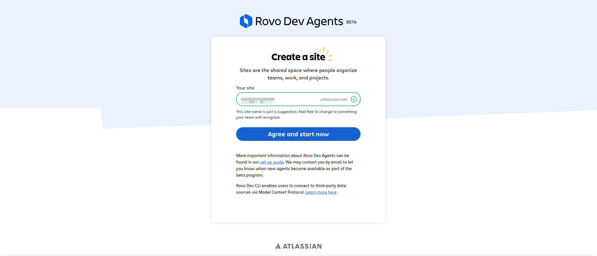

## 1.参考

**官方地址:**
https://atlassian.com

**账号注册地址:**

https://id.atlassian.com/login

**API 令牌地址**

https://id.atlassian.com/manage-profile/security/api-tokens

**官方下载CLI地址:**
https://developer.atlassian.com/cloud/acli/guides/install-acli/

**Dovo Dev Agents**

https://www.atlassian.com/try/cloud/signup?bundle=devai

**Rovo Dev CLI 文档**

https://support.atlassian.com/rovo/docs/rovo-dev-cli-quickstart-guide/

## 2.前置条件

**系统版本: **windows macos linux

**软件依赖: **shell

**权限要求: **无

**网络要求: **国际网代理

**其他注意事项: **无

## 3.环境准备

### 3.1.注册账号

**账号注册地址:**

https://id.atlassian.com/login


**演示谷歌账号注册**


**检查邮箱和用户名创建用户**


**进入控制台即注册成功**


### 3.2.创建API令牌

**API 令牌地址**

https://id.atlassian.com/manage-profile/security/api-tokens


**创建令牌**


**Name** 令牌名称

**到期日期** 最长设置1年，建议选择最大日期


**API token** 复制保存好令牌


## 4.安装部署

### 4.1.选择系统环境

**MacOS**

**Windows**

**Linux**


### 4.2.Windows环境安装

根据windows 架构选择下载连接，截取url部分在浏览器执行下载

**x86-64**  https://acli.atlassian.com/windows/latest/acli_windows_amd64/acli.exe

**ARM64** https://acli.atlassian.com/windows/latest/acli_windows_arm64/acli.exe


**移动acli.exe到** `C:\Windows\System32`

移动到C:\Windows\System32即可以在任意目录执行 `acli` 命令


## 5.配置说明

### 5.1.交互式命令

```
acli rovodev run
```

### 5.2.非交互式命令

```
acli rovodev run <instruction>
```
### 5.3.指令集 instruction

| 命令           | 功能说明                                                     |
|--------------| ------------------------------------------------------------ |
| /models      | 查看并选择可用的模型。                                       |
| /sessions    | 查看和管理代理会话。                                         |
| /clear       | 清空当前会话的消息历史。                                     |
| /prune       | 在保留上下文的同时减少当前会话消息历史的令牌大小。           |
| /instructions | 执行已保存的指令。                                           |
| /memory      | 管理内存文件。                                               |
| `# <note>`     | 向 Rovo Dev 的本地内存文件添加笔记。                         |
|`#! <note>`    | 从 Rovo Dev 的本地内存文件删除笔记。                         |
| /feedback    | 提供反馈或报告 Rovo Dev CLI 的错误。                         |
| /yolo        | 切换 YOLO 模式，开启后所有文件增删改查操作和 bash 命令无需确认。请谨慎使用！ |
| /copy        | 复制代理的最后一次响应到剪贴板。                             |
| /jira        | 配置 Jira 项目连接（使用 `/jira global` 或 `/jira local`）。 |
| /mcp         | 管理 MCP 服务器。                                            |
| /directories | 管理允许访问的外部目录。                                     |
| /status      | 显示 Rovo Dev CLI 状态，包括版本、账号信息和模型。           |
| /exit        | 退出应用，也可使用 `/quit`、`/q`、`exit`、`quit` 或 `q`。    |
| /usage       | 显示每日 LLM 令牌使用情况。                                  |
| /help        | 显示帮助信息和可用命令。或输入 `/<command> help` 查看子命令。 |

## 6.常用操作

### 6.1.运行服务

#### 6.1.1.选择目录

**打开命令窗口**

**切换至项目目录** `cd 项目根路径`

#### 6.1.2.登录认证

**执行认证登录命令**

```bash
acli rovodev auth login
```

**Enter your email** 输入注册邮箱

**Enter your API token** 输入API Token


#### 6.1.3.创建 Rovo Dev Agents

**执行运行服务命令**

```acli rovodev run```


**点击跳转注册**

**Dovo Dev Agents**

https://www.atlassian.com/try/cloud/signup?bundle=devai

**登录站点**


**创建站点**



**常见问题**：出现该错误，使用苹果手机执行6.1.3步骤，可以正常创建，具体原因不清楚


#### 6.1.4.运行服务

**重新执行运行服务命令**

```acli rovodev run```


### 6.2.AI编程

#### 6.2.1.切换模型

执行命令

```/models```

**Auto** 自动选择 默认：Claude Sonnet 4 

**GPT-5**

**Claude Sonnet 4** 


#### 6.2.2.输入需求


#### 6.2.3.选择执行

选择策略等待执行完毕

**Allow (ones)**: 同意本次。

**Allow (session)**: 本次会话 session 中永远同意。

**Allow (always)**: 永远同意。

**Deny (ones)**: 拒绝本次。

**Deny (session)**: 本次会话 session 中永远拒绝。

**Deny (always)**: 永远拒绝


## 7.排错与日志

## 8.升级与维护

## 9.附录